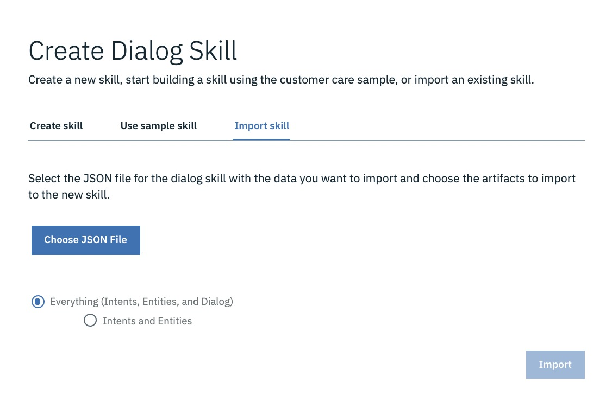

# _**Watson Assistant 101**_: Lab 2 - Adding Rich Content
In this lab we'll enhance our chatbot so that it can respond to users using images as well as text.

## Requirements
- Successful completion of [Lab 1: Build A Chatbot](../1-Basics).

## Agenda
- Understanding rich content
- Adding rich content: sending images
- Exporting/Importing _**Watson Assistant**_ skills

## Understanding rich content
You can return responses with multimedia or interactive elements such as _**images**_ or clickable _**option**_ buttons to simplify interaction within your chatbot and enhance the user experience.

In addition to the default response type of _**Text**_, for which you specify the text to return to the user as a response, the following response types are also supported:

_**Image**_: Embeds an image into the response. The source image file must be hosted somewhere and have a URL that you can use to reference it. It cannot be a file that is stored in a directory that is not publicly accessible.

_**Option**_: Adds a _list_ of one or more options. When a user clicks one of the options, an associated user input value is sent to the service. We'll add some _options_ to our chatbot later.

_**Pause**_: Forces the application to _wait_ for a specified number of milliseconds before continuing with processing. You might use this response type if you need to perform an action that might take some time, for example, if a parent node makes an external API call that takes a few seconds to respond.

## Adding rich content: sending images
Let's add some images to our existing responses.

**(1)** Select the `Brand Positive` dialog node, and then the `Edit Response` icon for the `@brand:Apple` response.

**(2)** Select `Add response type` and then `Image` from the drop-down menu.

**(3)** Enter `iPhone XR` as the **Title**, use `https://bit.ly/2S0WmWg` as the **Image source**, and hit `Save`. If you enter this URL into a web browser you should see an image of an _iPhone XR_. You can use any image URL you like here of course - try searching Google Images if you want to use your own.

**(4)** Test this out by using the `Try It` tool again. When the user says they are an Apple fan, they now also get an image of the recommended device:

**(5)** Complete the `New Phone` dialog by adding images to **all** responses. You can find your own images to add to your skill, or use the ones listed below.

For the `Brand Positive` node:

Brand   | Title     | Image source
--------|-----------|-----------------------
Apple   | `iPhone XR` | `https://bit.ly/2S0WmWg`
Google  | `Pixel 3`   | `https://bit.ly/2EhAuC1`
Samsung | `Galaxy S9` | `https://bit.ly/2zWQlmH`

**(6)** For the `Brand Negative` node, ensure you display **both** of the options we are suggesting in our text response to the user, using the same **Title** and **Image source** values as above. As an example, the `@brand:Apple` response should look like this:

**(7)** For the `Attribute Positive` node, use these values:

Attribute | Title            | Image source
----------|------------------|-------------------------
Battery   | `Nokia 3310 `    | `https://bit.ly/2RX48kj`
Style     | `Huawei P20 Pro` | `https://bit.ly/2BdHME0`

**(8)** Test out your _dialog_ again using the `Try It` button. Here's how it should look:

## Summary
Great stuff! You've enhanced your chatbot to respond using both text and images, based on feedback from your end user.

If you need to you can download the _**Watson Assistant**_ skill we've created so far from [here](./assistant/skill-Phone-Advisor-lab-2.json).

There's an `Import Skill` option available whenever you create a new skill - it can help if you want to back up skills, share them with others, etc.:

  

Now go to [Lab 3: Implement Your Bot!](../3-Live) to get your chatbot working in a live environment.
