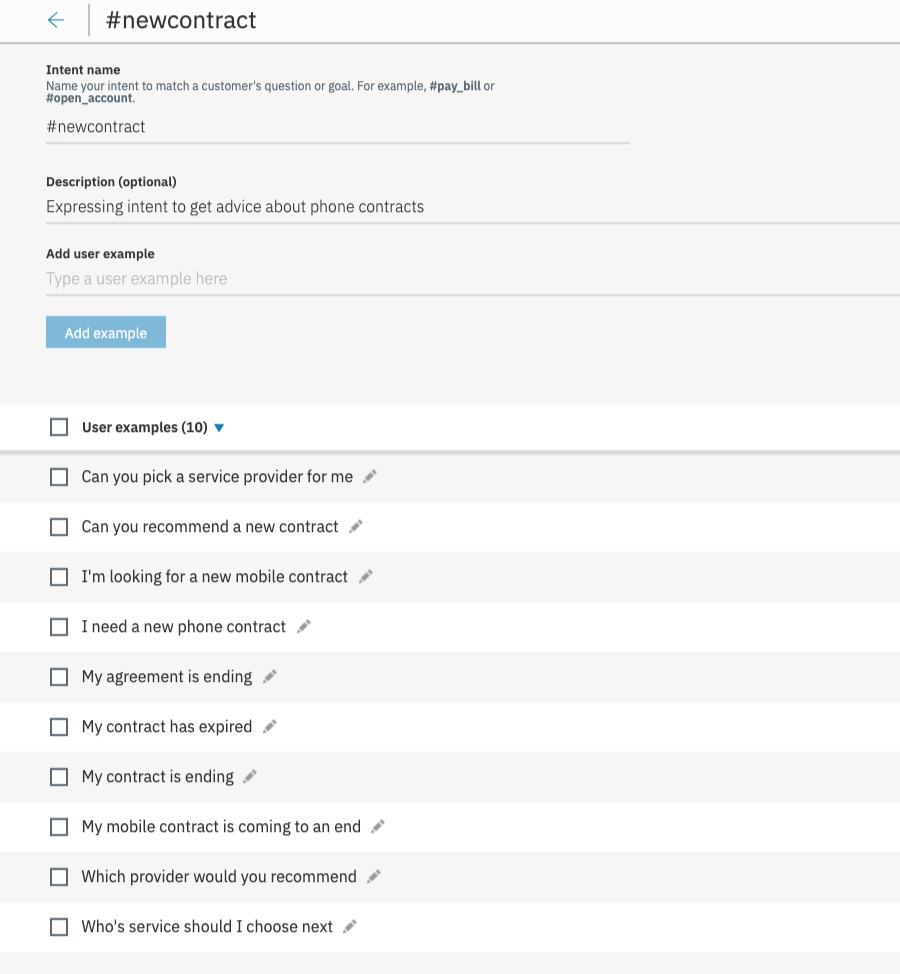
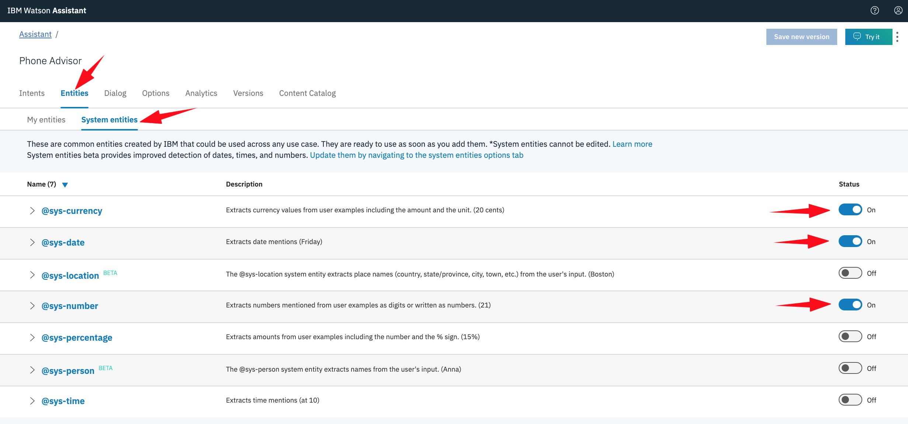
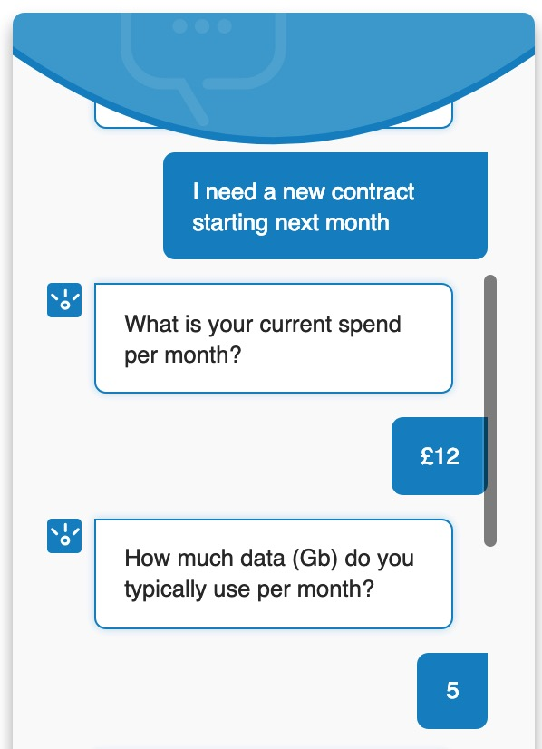

# _**Watson Assistant 101**_: Lab 4 - Enhancing Your Chatbot (I)
In this lab we'll use some more advanced _**Watson Assistant**_ capabilities to further develop our chatbot, so that it can also recommend a new mobile service provider, based on requirements provided by the user.

## Requirements
- Successful completion of [Lab 3: Implement Your Bot!](../3-Live)

## Agenda
- how to manage multiple user inputs in _**Watson Assistant**_
- extend existing _dialog_ to cater for multiple user inputs: _**Slots**_
- using _**System Entities**_ and _**context variables**_

## How to manage multiple user inputs in _**Watson Assistant**_
_**Slots**_ are a function within _**Watson Assistant**_ that allow you to more easily gather multiple pieces of information from a user. Slots collect information at the user's pace - if some of the information is provided up front it is saved, and then the service will only ask for the details that still need to be collected.

For example, when making making a dinner reservation you would probably want to capture the number of guests, restaurant name, date and time. _Slots_ guide the user down the _dialog_ path to ensure all of the required data is captured, by prompting the user for each required piece of information.


The user might provide values for multiple _slots_ at once. For example, the input might include the information, "_There will be 6 of us dining at 7 PM._" This one input contains two of the missing required values: the _number of guests_ and _time of the reservation_. The service recognises and stores both of these, each one in its corresponding _slot_. It then displays the prompt that is associated with the next empty _slot_.


## Extending our _dialog_ to cater for multiple user inputs: _**Slots**_
**(1)** Our chatbot is going to use _Slots_ to help guide the user to the most appropriate new mobile phone contract for them (based on some data collected about their existing usage), so we first need to create a new _intent_ that recognises when the user is looking for a new contract. Add a `newcontract` _intent_ to your existing _**Watson Assistant**_ _skill_ now ... something like this should do it ...



**(2)** In order to search for the best deal, we are going to collect three pieces of information: current **spend**, current **data usage**, and **when** the user would like the new contract to start.

_**Watson Assistant**_ can provide us with some help here, by looking for any _**System Entities**_ we might want to collect. _System entities_ can be used to automatically recognise a broad range of values for the object types they represent. For example, the **@sys-number** system entity matches any numerical value, including whole numbers, decimal fractions, or even numbers written out as words.

In your Watson Assistant skill, go to `Entities`, `System Entities`, and turn on the ones we'll need here: `sys-currency` (for _spend_), `sys-number` (for _data usage_) and `sys-date` (for _new contract date_).



**(3)** Now add a new _dialog_ node under the `New phone` node by clicking the three dots and selecting `Add node below`:


**(4)** Call your new _dialog_ node `New Contract`, and ensure it is called when your `#newcontract` _intent_ is recognised. At this point, you should hit the `Customize` button ...


... and then ensure **Slots** and **Multiple responses** are set to `On`:


**(5)** We are now going to configure our _dialog_ node to ensure we collect the three pieces of information required and provide a summarising response, like so:  


As you collect responses from the user using _slots_, they are saved in _context variables_. We use _context variables_ to pass information to other _**Watson Assistant**_ _dialog_ nodes. For example, if we asked for and captured the user's name in a _context variable_ called **$userName**, we could then use it to personalise our responses, e.g. **Hi $userName, how can I help you today?**. This is also the mechanism we use to pass data to and from external applications and services.

**(6)** Back to our `New Contract` _dialog_ node. If _**Watson Assistant**_ finds currency (e.g. _£20_) as input, it adds it to the `$costPerMonth` _context variable_. Similarly, a number will go to `$dataPerMonth`, and a date to `$contractStart`. If these are not found initially, it will use the **If Not Present, Ask** prompts to ensure they are completed by the user.

The **If not present, ask** fields for each _slot_ should contain something like:

Slot  |  Response
--|--
`$costPerMonth`  |  `What is your current spend per month?`
`$dataPerMonth`  |  `How much data (Gb) do you typically use per month?`
`$contractStart`  |  `When do you need your new contract to start?`

**(7)** When all of the _slots_ are full, note that we respond with a confirmation message that includes and plays back the `context variables` to the user:
```
So you're looking for a new contract starting $contractStart, with around $dataPerMonth Gb of data per month, costing in the region of £$costPerMonth each month.
```
Make sure you've added this text to the **Then respond with** field.

**(8)** Use the `Try It` option to see how this works in practice.  If you don't enter any of the details we need on the original request, you should get three prompts:                                


**(9)** If you enter a _date_ as part of your original request, then _**Watson Assistant**_ realises that only the _spend_ and _data usage slots_ still need to be collected. Hit `Clear` to reset the dialog and then try this out:


**(10)** Note that the **@sys-date** _entity_ doesn't have to be in a specific format.  _**Watson Assistant**_ will also pick up and translate _entities_ like '_now_', '_tomorrow_', '_next month_', etc.

**(11)** Now we need to build the contract recommendation _dialog_. We'll do this by adding a  child node to our `New Contract` _dialog_ node (call it `Recommend Contract`) which will provide a contract recommendation based upon the user's existing data usage and spend.

Ensure this child node can cater for **Multiple responses**, by hitting `Customize` and toggling the option to `On`. Now set **If assistant recognizes** to `true`, to ensure we immediately drop into our checks.

_**Watson Assistant**_ can perform evaluations of expressions that include _context variables_, which is what we are going to do here. Ensure the `Recommend Contract` node performs the following tests and replies with the associated text:

If assistant recognizes              | Respond with
-------------------------------------|--------------------------------------------------------------------------------------------------------------
`$costPerMonth>20 && $dataPerMonth>10` | `Your best package currently available is BT Unlimited Data, for £24.99 per month.`
`$costPerMonth>20 && $dataPerMonth<10` | `For this amount of data usage you can actually get a contract with EE for 10Gb data at just £16.99 per month.`
`$costPerMonth>10 && $dataPerMonth>5` | `Three have the best comparable package with 8Gb for £12.99 per month.`
`$costPerMonth>10 && $dataPerMonth<5` | `Try O2, they have a package for a monthly charge of £7.99 that includes 4Gb data.`
`$costPerMonth>0 && $dataPerMonth>0`  | `The best low cost package is currently with Vodafone: 2Gb data for £4.99 per month.`
`$dataPerMonth<=0`                    | `If you don't want data, then try Tesco Mobile's Voice Only contract for a £3.99 monthly fee.`

When we've made the recommendation, we should ask the user if they want anything any more assistance, so once again ensure that **And finally** of this child node is set to `Jump to Help (Response)`.


**(12)** To complete this _dialog_ branch, you should now go back to your `New Contract` node and edit the **And finally** option so that when we drop out of _slot_ gathering we `Skip user input` and immediately perform the tests on the collected data in the `Recommend Contract` child node:


**(13)** Test your completed `New Contract` _dialog_ out. It should look something like this:


You might notice that if you ask the same question without hitting `Clear`, _**Watson Assistant**_ doesn't ask the user for the information we expect, and in fact reuses the same `slot` data as before.


When we use _context variables_ in a _dialog_, we need to ensure that we **reinitialise** them after they have been used. If we don't do this, the next time we go through the same dialog node, _**Watson Assistant**_ won't ask for the _slot_ information, as the _slots_ have already been _'filled'_.

**(14)** There are a number of ways of reintialising _context variables_. Here we are going to change our `Help` node to perform the resets - this is a good node to use for this purpose because we drop into it **every time** we've successfully completed a user interaction.

Click on your `Help` node and rename it to `Help & Reset Context`, then click on the 'three-dots' icon and `Open context editor`.


Within the _**context editor**_, we now just need to add each of the _context variables_ we've used, and set them all to `null`.


Now every time we enter this node, our context will be reset. Check this works by using `Try It` again. If you go through the `New Contract` _dialog_ a few times now, you'll see the _dialog_ always asks the user for all of the data required and responds with the appropriate recommendation.

**(15)** When you've fully tested your _dialog_ and you're satisfied it's working correctly, go and see what it looks like using your preview link.




## Summary
You've reached the end of the first Advanced Chatbot lab! Your chatbot has been extended using _**slots**_ and _**context variables**_.

Now try out [Lab 5: Enhancing Your Chatbot (II)](../5-Advanced2), where we'll show you how to apply further intelligence to your responses by applying some more advanced _**Watson Assistant**_ functionality.
